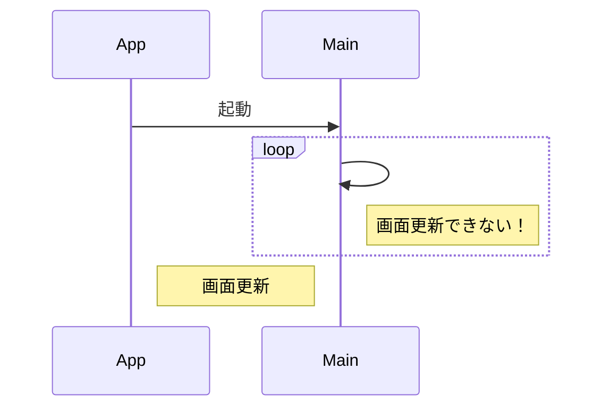
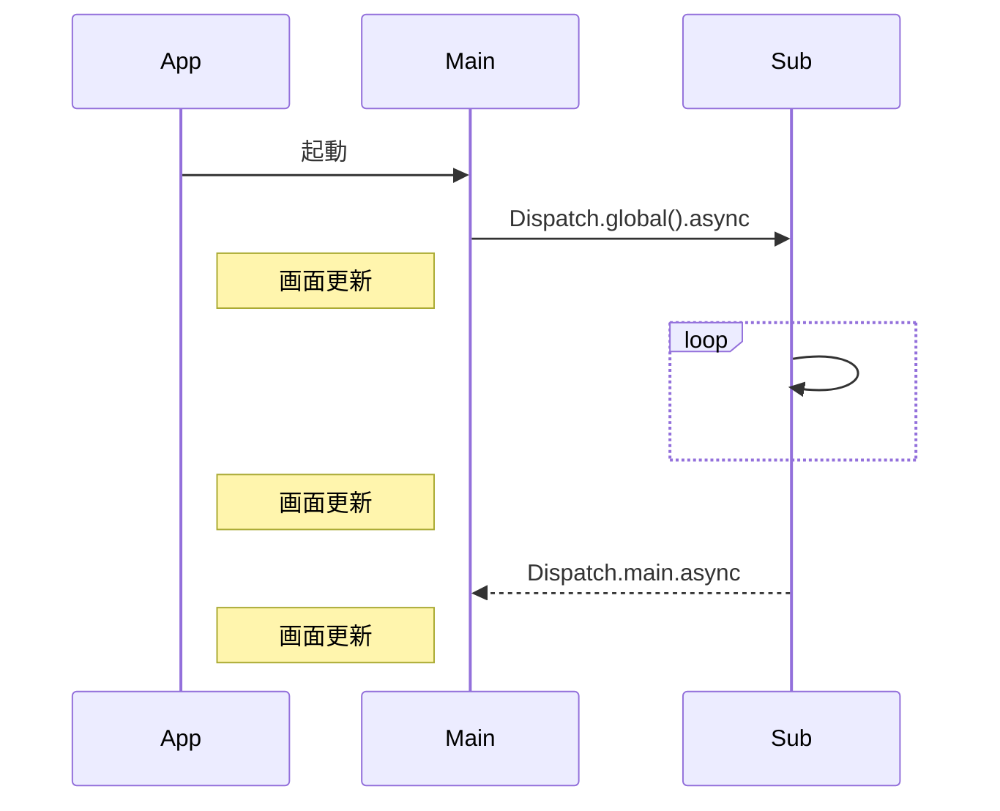

iOSアプリで時間のかかる処理が発生すると何が起こるのでしょうか？

デモアプリを用意したので、手元で確認しながら読み進めることをできるようにしています。

https://github.com/ykws/FreezingApp

# はじめに

レビューをしていて時間のかかる処理に対して、iOSアプリではこれを使えば良いと示すのは簡単ですが、どうしてそれが必要なのか順序立てて説明するために今回の記事を書きました。

フレームワークが高度に抽象化し、良しなにやってくれるので、現代のプログラミングにおいては知らなくて良いことの一つかもしれません。

# 時間のかかる処理とは

例えば、以下のようなアプリがあったとして、「Push Me!」のボタンをタップしたとします。


すると、地球のアイコンがインジケーターに変わって回転のアニメーションが始まり、何か処理を行なっている様子を感じ取れます。しばらくすると、インジケーターが地球のアイコンに戻り、処理が完了した様子を感じ取れます。


iOSアプリでは、至る所にユーザに対してアニメーションのフィードバックを返して何が起こっているのか絶えずユーザに伝える工夫がなされており、それが当たり前になっています。

このアプリで採用しているインジケーターは Progress Indicators の一種になり、 Human Interface Guidelines にも記載があります。

https://developer.apple.com/design/human-interface-guidelines/components/status/progress-indicators

さて、実は以下の画面でも上記と同じように処理を行なっているのですが、何か処理が始まっても地球のアイコンのままでインジケーターに変わりません。しばらくすると、同じように処理は完了するようですが、アニメーションがないため、いつ完了したのかわかりません。ユーザからするとアプリが固まったように見えます。開発者が気をつけないと、時間のかかる処理に対して、前述の当たり前のフィードバックは実現できないことも容易に起こり得てしまいます。


# 一体何が起こっているのか？

コンピュータの基本に立ち戻ると、iOSアプリも**入力・処理・出力**を繰り返して制御しています。このうちの入力と出力に注目してみます。

iOSアプリを含むモバイルアプリは、デバイスに搭載されている**ディスプレイから入力を受け取り、処理結果の出力を行っています**。**このディスプレイという入出力ソースは1つ**しかないことがほとんどです。モバイルアプリでは、メインスレッドというプログラムからの命令を受け付ける一本の流れが用意されています。時間のかかる処理がないようなアプリにおいては、このメインスレッドを意識する必要がないケースもあります。

このメインスレッドで受け付けた命令は順番に処理を実行するため、時間のかかる処理が発生した場合、その間処理が止まり、画面の更新ができなくなるため、固まったように見えてしまいます。

:::details スレッド
アプリケーションは一度に一つの処理しかできません。この一つの処理を実行可能な処理単位としてスレッドと呼んでいます。
:::

# どうすれば良い？

そこで、時間のかかる処理に対しては、メインスレッドとは**別のスレッドを用意して、処理を委譲する**ことが可能になっています。

時間のかかる処理をメインスレッドとは別のスレッドに任せることで、画面の更新を行いつつ、時間のかかる処理を並行して行い、処理が完了したら、その結果を画面に反映する、といったことが可能になっています。

この時問題になるのは、このようにしてメインスレッドとは別のスレッドを複数作成して、前述の限られた入出力ソースへのアクセスも行おうとすると、マルチスレッドプログラミングでの課題に向き合う必要が生じます。排他制御、同期制御、デッドロックなど。これを避けるためにも、モバイルアプリでは、**メインスレッド以外での入出力ソースへのアクセスを禁止しています**。

:::details UIスレッド
メインスレッドで画面に対する処理を行うように限定されているため、メインスレッドのことを**UIスレッド**と呼ぶこともあります。デモアプリの方では、UIの方からアプローチしているので、UIスレッドという表現を採用しました。今回のデモアプリのように、画面が固まってしまうことを**UIスレッドをブロックしている**と表現します。
:::

:::details マルチスレッド
メインスレッドとは別のスレッドを複数作成して、複数のスレッドを利用すること。マルチスレッドを利用して処理を切り替えて機能を実現していくことをマルチスレッドプログラミングと呼んでいます。
:::

そのため、時間のかかる処理を別スレッドに委譲し、処理結果を出力する際はメインスレッドへの切り戻しが必要になっています。

## Grand Central Dispatch

iOSアプリにおいて、これを楽に実現できるように、 **Grand Central Dispatch** という仕組みがあります。

https://developer.apple.com/documentation/dispatch/dispatchqueue

時間のかかる処理を行いたい時に `DispatchQueue.global().async` のクロージャに渡すことでキューに処理を渡せます。この宣言で別のスレッドに切り替わるので、メインスレッドの処理を中断することを回避できます。

```swift
DispatchQueue.global().async {
  // 時間のかかる処理
}
```

メインスレッドで画面の更新を行いたい時に `DispatchQueue.main.async` のクロージャに渡すことでキューに処理を渡せます。この宣言でメインスレッドに切り替わるので、画面の更新を行えるようになります。 iOSアプリではメインスレッド以外での画面の更新を禁止しているので必要な切り替え処理になっています。

```swift
DispatchQueue.main.async {
  // 画面の更新
}
```

たったこれだけで、ここまで書いてきたことの詳細に触れずにマルチスレッドの恩恵を受けることができるようになっています。つまり、時間のかかる処理が発生してもアプリが固まってしまうことを回避できます。

## シーケンス図

シーケンス図を利用すると、以下のようなイメージになります。

### 固まってしまうシーケンス

loop の部分で**UIスレッドをブロックしている**ので、この間、画面の更新はできません。そのため、ユーザからは固まったように見えてしまいます。



### 固まるのを回避するシーケンス

loop の部分で**UIスレッドをブロックしないように** Main から Sub へ loop を処理するスレッドを`Dispatch.global().async` で切り替えています。この命令から Main と Sub のマルチスレッドが開始します。 Main の画面更新と時間のかかる Sub の処理が並行して処理され、固まったように見えることを回避できます。 loop の間も、デモアプリのインジケーターの部分は、UIスレッドがブロックされないので、常時アニメーションされます。

Sub スレッドの方で画面の更新を新たに命令したい場合は、 UIスレッドに切り戻すために `Dispatch.main.async` が必要になっています。



# 参考文献

GCD(Grand Central Dispatch)に関する文献・記事は Objective-C で扱われていることが多いです。以下、いずれも Swift ではなく、 Objective-C を扱っています。

- [エキスパートObjective-Cプログラミング　-iOS/OS Xのメモリ管理とマルチスレッド-](https://book.impress.co.jp/books/3109)

## 関連記事

- [UI 関連の機能はメインスレッドで実行すること : Objective-C プログラミング](https://ez-net.jp/article/D9/pFIzkE5B/-augKeCpM4zZ/)
- [macOS/iOSスレッドプログラミング（ThreadとRunLoop）](https://qiita.com/cubenoy22/items/098a90133dfdc3f33ccc)

# Swift Concurrency

なお Swift Concurrency を利用するとここまで述べてきたことも気にしなくて良くなります。

```swift
await doSomething() // 時間のかかる処理
// 画面の更新
```

たったこれだけになります。 `await` のキーワードでスレッドを意識しないで、時間のかかる処理の結果を待ち、処理が完了したら画面の更新をすれば良いだけになります。

ただし、これを実行しているのがメインスレッドである場合に限るので、別のコードがこの処理をメインスレッド以外で呼んでいた場合は、画面の更新ではやはり、メインスレッドの切り替えは必要になります。

Swift Concurrency については以下の記事が詳しく、ここでは詳細には触れません。

https://zenn.dev/akkyie/articles/swift-concurrency

# もっと深く

ここまで見てきたマルチスレッドプログラミングについて、もっと深く知りたくなった人向けの書籍を紹介して終わります。（私は積読しており、未来の自分に対するメッセージでもあります。）

https://www.oreilly.co.jp/books/9784873114354/
